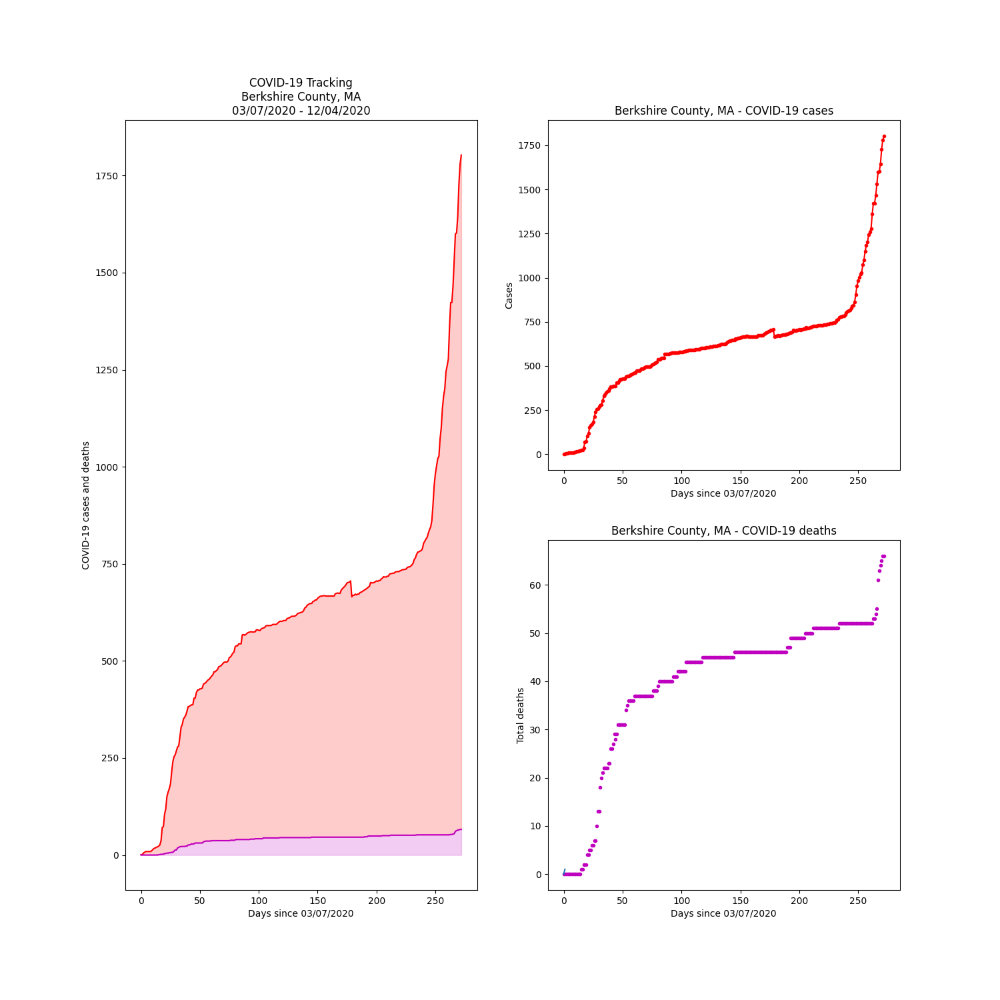

# Berkshire County, Massachusetts COVID-19 data

**Most Recent Update: 12/05/2020**

[Using the New York Time's covid tracker](https://raw.githubusercontent.com/nytimes/covid-19-data/master/us-counties.csv)

# COVID daily data

Date        |  Cases (Total Δ=Daily Change)  |  Deaths (Total Δ=Daily Change)
------------|--------------------------------|-------------------------------
2020-12-05  |  1903: Δ=100                   |  68: Δ=2
2020-12-04  |  1803: Δ=23                    |  66: Δ=0
2020-12-03  |  1780: Δ=52                    |  66: Δ=1
2020-12-02  |  1728: Δ=83                    |  65: Δ=1
2020-12-01  |  1645: Δ=43                    |  64: Δ=1
2020-11-30  |  1602: Δ=2                     |  63: Δ=2
2020-11-29  |  1600: Δ=69                    |  61: Δ=6
2020-11-28  |  1531: Δ=65                    |  55: Δ=1
2020-11-27  |  1466: Δ=43                    |  54: Δ=1
2020-11-26  |  1423: Δ=0                     |  53: Δ=0
2020-11-25  |  1423: Δ=64                    |  53: Δ=1
2020-11-24  |  1359: Δ=82                    |  52: Δ=0
2020-11-23  |  1277: Δ=17                    |  52: Δ=0
2020-11-22  |  1260: Δ=15                    |  52: Δ=0
2020-11-21  |  1245: Δ=44                    |  52: Δ=0
2020-11-20  |  1201: Δ=19                    |  52: Δ=0
2020-11-19  |  1182: Δ=31                    |  52: Δ=0
2020-11-18  |  1151: Δ=50                    |  52: Δ=0
2020-11-17  |  1101: Δ=29                    |  52: Δ=0
2020-11-16  |  1072: Δ=45                    |  52: Δ=0
2020-11-15  |  1027: Δ=6                     |  52: Δ=0
2020-11-14  |  1021: Δ=20                    |  52: Δ=0
2020-11-13  |  1001: Δ=19                    |  52: Δ=0
2020-11-12  |  982: Δ=29                     |  52: Δ=0
2020-11-11  |  953: Δ=50                     |  52: Δ=0
2020-11-10  |  903: Δ=42                     |  52: Δ=0
2020-11-09  |  861: Δ=16                     |  52: Δ=0
2020-11-08  |  845: Δ=7                      |  52: Δ=0
2020-11-07  |  838: Δ=9                      |  52: Δ=0
2020-11-06  |  829: Δ=11                     |  52: Δ=0
2020-11-05  |  818: Δ=4                      |  52: Δ=0
2020-11-04  |  814: Δ=6                      |  52: Δ=0
2020-11-03  |  808: Δ=5                      |  52: Δ=0
2020-11-02  |  803: Δ=14                     |  52: Δ=0
2020-11-01  |  789: Δ=5                      |  52: Δ=0
2020-10-31  |  784: Δ=1                      |  52: Δ=0
2020-10-30  |  783: Δ=2                      |  52: Δ=0
2020-10-29  |  781: Δ=1                      |  52: Δ=0
2020-10-28  |  780: Δ=6                      |  52: Δ=0
2020-10-27  |  774: Δ=9                      |  52: Δ=1
2020-10-26  |  765: Δ=4                      |  51: Δ=0
2020-10-25  |  761: Δ=10                     |  51: Δ=0
2020-10-24  |  751: Δ=4                      |  51: Δ=0
2020-10-23  |  747: Δ=3                      |  51: Δ=0
2020-10-22  |  744: Δ=2                      |  51: Δ=0
2020-10-21  |  742: Δ=0                      |  51: Δ=0
2020-10-20  |  742: Δ=2                      |  51: Δ=0
2020-10-19  |  740: Δ=4                      |  51: Δ=0
2020-10-18  |  736: Δ=0                      |  51: Δ=0
2020-10-17  |  736: Δ=1                      |  51: Δ=0
2020-10-16  |  735: Δ=0                      |  51: Δ=0
2020-10-15  |  735: Δ=2                      |  51: Δ=0
2020-10-14  |  733: Δ=1                      |  51: Δ=0
2020-10-13  |  732: Δ=2                      |  51: Δ=0
2020-10-12  |  730: Δ=0                      |  51: Δ=0
2020-10-11  |  730: Δ=0                      |  51: Δ=0
2020-10-10  |  730: Δ=1                      |  51: Δ=0
2020-10-09  |  729: Δ=3                      |  51: Δ=0
2020-10-08  |  726: Δ=0                      |  51: Δ=0
2020-10-07  |  726: Δ=1                      |  51: Δ=0
2020-10-06  |  725: Δ=0                      |  51: Δ=0
2020-10-05  |  725: Δ=2                      |  51: Δ=1
2020-10-04  |  723: Δ=5                      |  50: Δ=0
2020-10-03  |  718: Δ=0                      |  50: Δ=0
2020-10-02  |  718: Δ=2                      |  50: Δ=0
2020-10-01  |  716: Δ=0                      |  50: Δ=0
2020-09-30  |  716: Δ=-1                     |  50: Δ=0
2020-09-29  |  717: Δ=4                      |  50: Δ=0
2020-09-28  |  713: Δ=2                      |  50: Δ=1
2020-09-27  |  711: Δ=4                      |  49: Δ=0
2020-09-26  |  707: Δ=0                      |  49: Δ=0
2020-09-25  |  707: Δ=2                      |  49: Δ=0
2020-09-24  |  705: Δ=-1                     |  49: Δ=0
2020-09-23  |  706: Δ=2                      |  49: Δ=0
2020-09-22  |  704: Δ=2                      |  49: Δ=0
2020-09-21  |  702: Δ=1                      |  49: Δ=0
2020-09-20  |  701: Δ=0                      |  49: Δ=0
2020-09-19  |  701: Δ=-1                     |  49: Δ=0
2020-09-18  |  702: Δ=10                     |  49: Δ=0
2020-09-17  |  692: Δ=2                      |  49: Δ=0
2020-09-16  |  690: Δ=3                      |  49: Δ=2
2020-09-15  |  687: Δ=2                      |  47: Δ=0
2020-09-14  |  685: Δ=2                      |  47: Δ=0
2020-09-13  |  683: Δ=2                      |  47: Δ=1
2020-09-12  |  681: Δ=2                      |  46: Δ=0
2020-09-11  |  679: Δ=2                      |  46: Δ=0
2020-09-10  |  677: Δ=1                      |  46: Δ=0
2020-09-09  |  676: Δ=4                      |  46: Δ=0
2020-09-08  |  672: Δ=0                      |  46: Δ=0
2020-09-07  |  672: Δ=2                      |  46: Δ=0
2020-09-06  |  670: Δ=-2                     |  46: Δ=0
2020-09-05  |  672: Δ=3                      |  46: Δ=0
2020-09-04  |  669: Δ=0                      |  46: Δ=0
2020-09-03  |  669: Δ=4                      |  46: Δ=0
2020-09-02  |  665: Δ=-41                    |  46: Δ=0
2020-09-01  |  706: Δ=3                      |  46: Δ=0
2020-08-31  |  703: Δ=1                      |  46: Δ=0
2020-08-30  |  702: Δ=1                      |  46: Δ=0
2020-08-29  |  701: Δ=5                      |  46: Δ=0
2020-08-28  |  696: Δ=4                      |  46: Δ=0
2020-08-27  |  692: Δ=3                      |  46: Δ=0
2020-08-26  |  689: Δ=3                      |  46: Δ=0
2020-08-25  |  686: Δ=4                      |  46: Δ=0
2020-08-24  |  682: Δ=8                      |  46: Δ=0
2020-08-23  |  674: Δ=0                      |  46: Δ=0
2020-08-22  |  674: Δ=-1                     |  46: Δ=0
2020-08-21  |  675: Δ=1                      |  46: Δ=0
2020-08-20  |  674: Δ=1                      |  46: Δ=0
2020-08-19  |  673: Δ=6                      |  46: Δ=0
2020-08-18  |  667: Δ=0                      |  46: Δ=0
2020-08-17  |  667: Δ=0                      |  46: Δ=0
2020-08-16  |  667: Δ=0                      |  46: Δ=0
2020-08-15  |  667: Δ=0                      |  46: Δ=0
2020-08-14  |  667: Δ=0                      |  46: Δ=0
2020-08-13  |  667: Δ=0                      |  46: Δ=0
2020-08-12  |  667: Δ=0                      |  46: Δ=0
2020-08-11  |  667: Δ=-1                     |  46: Δ=0
2020-08-10  |  668: Δ=0                      |  46: Δ=0
2020-08-09  |  668: Δ=1                      |  46: Δ=0
2020-08-08  |  667: Δ=0                      |  46: Δ=0
2020-08-07  |  667: Δ=1                      |  46: Δ=0
2020-08-06  |  666: Δ=2                      |  46: Δ=0
2020-08-05  |  664: Δ=3                      |  46: Δ=0
2020-08-04  |  661: Δ=4                      |  46: Δ=0
2020-08-03  |  657: Δ=0                      |  46: Δ=0
2020-08-02  |  657: Δ=3                      |  46: Δ=0
2020-08-01  |  654: Δ=1                      |  46: Δ=0
2020-07-31  |  653: Δ=5                      |  46: Δ=0
2020-07-30  |  648: Δ=0                      |  46: Δ=1
2020-07-29  |  648: Δ=1                      |  45: Δ=0
2020-07-28  |  647: Δ=2                      |  45: Δ=0
2020-07-27  |  645: Δ=2                      |  45: Δ=0
2020-07-26  |  643: Δ=5                      |  45: Δ=0
2020-07-25  |  638: Δ=2                      |  45: Δ=0
2020-07-24  |  636: Δ=7                      |  45: Δ=0
2020-07-23  |  629: Δ=3                      |  45: Δ=0
2020-07-22  |  626: Δ=1                      |  45: Δ=0
2020-07-21  |  625: Δ=1                      |  45: Δ=0
2020-07-20  |  624: Δ=1                      |  45: Δ=0
2020-07-19  |  623: Δ=1                      |  45: Δ=0
2020-07-18  |  622: Δ=4                      |  45: Δ=0
2020-07-17  |  618: Δ=2                      |  45: Δ=0
2020-07-16  |  616: Δ=1                      |  45: Δ=0
2020-07-15  |  615: Δ=0                      |  45: Δ=0
2020-07-14  |  615: Δ=0                      |  45: Δ=0
2020-07-13  |  615: Δ=2                      |  45: Δ=0
2020-07-12  |  613: Δ=2                      |  45: Δ=0
2020-07-11  |  611: Δ=1                      |  45: Δ=0
2020-07-10  |  610: Δ=1                      |  45: Δ=0
2020-07-09  |  609: Δ=5                      |  45: Δ=0
2020-07-08  |  604: Δ=0                      |  45: Δ=0
2020-07-07  |  604: Δ=0                      |  45: Δ=0
2020-07-06  |  604: Δ=2                      |  45: Δ=0
2020-07-05  |  602: Δ=0                      |  45: Δ=0
2020-07-04  |  602: Δ=0                      |  45: Δ=0
2020-07-03  |  602: Δ=2                      |  45: Δ=1
2020-07-02  |  600: Δ=3                      |  44: Δ=0
2020-07-01  |  597: Δ=3                      |  44: Δ=0
2020-06-30  |  594: Δ=0                      |  44: Δ=0
2020-06-29  |  594: Δ=0                      |  44: Δ=0
2020-06-28  |  594: Δ=0                      |  44: Δ=0
2020-06-27  |  594: Δ=2                      |  44: Δ=0
2020-06-26  |  592: Δ=1                      |  44: Δ=0
2020-06-25  |  591: Δ=0                      |  44: Δ=0
2020-06-24  |  591: Δ=0                      |  44: Δ=0
2020-06-23  |  591: Δ=0                      |  44: Δ=0
2020-06-22  |  591: Δ=1                      |  44: Δ=0
2020-06-21  |  590: Δ=4                      |  44: Δ=0
2020-06-20  |  586: Δ=1                      |  44: Δ=0
2020-06-19  |  585: Δ=1                      |  44: Δ=2
2020-06-18  |  584: Δ=2                      |  42: Δ=0
2020-06-17  |  582: Δ=4                      |  42: Δ=0
2020-06-16  |  578: Δ=-1                     |  42: Δ=0
2020-06-15  |  579: Δ=-1                     |  42: Δ=0
2020-06-14  |  580: Δ=0                      |  42: Δ=0
2020-06-13  |  580: Δ=5                      |  42: Δ=0
2020-06-12  |  575: Δ=0                      |  42: Δ=1
2020-06-11  |  575: Δ=1                      |  41: Δ=0
2020-06-10  |  574: Δ=-1                     |  41: Δ=0
2020-06-09  |  575: Δ=0                      |  41: Δ=0
2020-06-08  |  575: Δ=1                      |  41: Δ=1
2020-06-07  |  574: Δ=1                      |  40: Δ=0
2020-06-06  |  573: Δ=2                      |  40: Δ=0
2020-06-05  |  571: Δ=3                      |  40: Δ=0
2020-06-04  |  568: Δ=2                      |  40: Δ=0
2020-06-03  |  566: Δ=-2                     |  40: Δ=0
2020-06-02  |  568: Δ=1                      |  40: Δ=0
2020-06-01  |  567: Δ=23                     |  40: Δ=0
2020-05-31  |  544: Δ=0                      |  40: Δ=0
2020-05-30  |  544: Δ=0                      |  40: Δ=0
2020-05-29  |  544: Δ=5                      |  40: Δ=0
2020-05-28  |  539: Δ=0                      |  40: Δ=0
2020-05-27  |  539: Δ=2                      |  40: Δ=1
2020-05-26  |  537: Δ=14                     |  39: Δ=1
2020-05-25  |  523: Δ=3                      |  38: Δ=0
2020-05-24  |  520: Δ=5                      |  38: Δ=0
2020-05-23  |  515: Δ=5                      |  38: Δ=0
2020-05-22  |  510: Δ=1                      |  38: Δ=1
2020-05-21  |  509: Δ=9                      |  37: Δ=0
2020-05-20  |  500: Δ=3                      |  37: Δ=0
2020-05-19  |  497: Δ=0                      |  37: Δ=0
2020-05-18  |  497: Δ=0                      |  37: Δ=0
2020-05-17  |  497: Δ=2                      |  37: Δ=0
2020-05-16  |  495: Δ=4                      |  37: Δ=0
2020-05-15  |  491: Δ=3                      |  37: Δ=0
2020-05-14  |  488: Δ=2                      |  37: Δ=0
2020-05-13  |  486: Δ=1                      |  37: Δ=0
2020-05-12  |  485: Δ=7                      |  37: Δ=0
2020-05-11  |  478: Δ=3                      |  37: Δ=0
2020-05-10  |  475: Δ=3                      |  37: Δ=0
2020-05-09  |  472: Δ=0                      |  37: Δ=0
2020-05-08  |  472: Δ=8                      |  37: Δ=0
2020-05-07  |  464: Δ=3                      |  37: Δ=0
2020-05-06  |  461: Δ=4                      |  37: Δ=1
2020-05-05  |  457: Δ=4                      |  36: Δ=0
2020-05-04  |  453: Δ=2                      |  36: Δ=0
2020-05-03  |  451: Δ=3                      |  36: Δ=0
2020-05-02  |  448: Δ=4                      |  36: Δ=0
2020-05-01  |  444: Δ=2                      |  36: Δ=1
2020-04-30  |  442: Δ=2                      |  35: Δ=1
2020-04-29  |  440: Δ=10                     |  34: Δ=3
2020-04-28  |  430: Δ=2                      |  31: Δ=0
2020-04-27  |  428: Δ=0                      |  31: Δ=0
2020-04-26  |  428: Δ=3                      |  31: Δ=0
2020-04-25  |  425: Δ=0                      |  31: Δ=0
2020-04-24  |  425: Δ=7                      |  31: Δ=0
2020-04-23  |  418: Δ=14                     |  31: Δ=0
2020-04-22  |  404: Δ=0                      |  31: Δ=2
2020-04-21  |  404: Δ=17                     |  29: Δ=1
2020-04-20  |  387: Δ=0                      |  28: Δ=-1
2020-04-19  |  387: Δ=2                      |  29: Δ=2
2020-04-18  |  385: Δ=2                      |  27: Δ=1
2020-04-17  |  383: Δ=1                      |  26: Δ=0
2020-04-16  |  382: Δ=12                     |  26: Δ=3
2020-04-15  |  370: Δ=10                     |  23: Δ=0
2020-04-14  |  360: Δ=5                      |  23: Δ=1
2020-04-13  |  355: Δ=5                      |  22: Δ=0
2020-04-12  |  350: Δ=14                     |  22: Δ=0
2020-04-11  |  336: Δ=7                      |  22: Δ=0
2020-04-10  |  329: Δ=25                     |  22: Δ=1
2020-04-09  |  304: Δ=23                     |  21: Δ=1
2020-04-08  |  281: Δ=3                      |  20: Δ=2
2020-04-07  |  278: Δ=10                     |  18: Δ=5
2020-04-06  |  268: Δ=10                     |  13: Δ=0
2020-04-05  |  258: Δ=5                      |  13: Δ=3
2020-04-04  |  253: Δ=13                     |  10: Δ=3
2020-04-03  |  240: Δ=27                     |  7: Δ=0
2020-04-02  |  213: Δ=30                     |  7: Δ=1
2020-04-01  |  183: Δ=12                     |  6: Δ=0
2020-03-31  |  171: Δ=9                      |  6: Δ=1
2020-03-30  |  162: Δ=11                     |  5: Δ=0
2020-03-29  |  151: Δ=32                     |  5: Δ=1
2020-03-28  |  119: Δ=14                     |  4: Δ=0
2020-03-27  |  105: Δ=32                     |  4: Δ=2
2020-03-26  |  73: Δ=2                       |  2: Δ=0
2020-03-25  |  71: Δ=34                      |  2: Δ=0
2020-03-24  |  37: Δ=11                      |  2: Δ=1
2020-03-23  |  26: Δ=3                       |  1: Δ=0
2020-03-22  |  23: Δ=2                       |  1: Δ=1
2020-03-21  |  21: Δ=1                       |  0: Δ=0
2020-03-20  |  20: Δ=2                       |  0: Δ=0
2020-03-19  |  18: Δ=1                       |  0: Δ=0
2020-03-18  |  17: Δ=3                       |  0: Δ=0
2020-03-17  |  14: Δ=3                       |  0: Δ=0
2020-03-16  |  11: Δ=2                       |  0: Δ=0
2020-03-15  |  9: Δ=0                        |  0: Δ=0
2020-03-14  |  9: Δ=0                        |  0: Δ=0
2020-03-13  |  9: Δ=0                        |  0: Δ=0
2020-03-12  |  9: Δ=0                        |  0: Δ=0
2020-03-11  |  9: Δ=2                        |  0: Δ=0
2020-03-10  |  7: Δ=2                        |  0: Δ=0
2020-03-09  |  5: Δ=4                        |  0: Δ=0
2020-03-08  |  1: Δ=0                        |  0: Δ=0
Berkshire   |  1 Δ=1                         |  0 Δ=0

